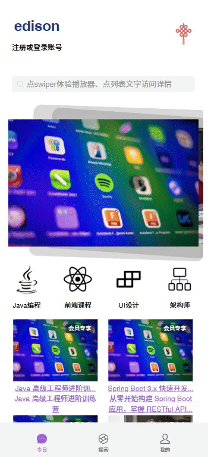

# 项目名称

在线知识付费平台（移动端）

## 技术栈

- React
- TypeScript
- Ant Mobile Design
- LeanCloud
- zustand

## 简介

该项目是 React+TypeScript+Ant Mobile Design+LeanCloud 搭建的在线知识付费平台移动端

- 课程展示页：轮播图展示、课程列表展示、课程详情展示
- 轮播课程：音频播放页、可用胶囊组件控制
- 课程探索页：课程分类展示、课程搜索
- 用户信息页：我的喜欢、头像、登录

## 功能展示



## 快速上手

- 克隆项目到本地

```bash
https://github.com/JP3000/online-course-mobile-react-ts.git
```

- 进入项目目录

```bash
cd online-course-mobile-react-ts
```

- 依赖项

```bash
npm install
```

- 运行

```bash
npm run dev
```

## 测试账户

账号：edison
密码：123123

## API 文档

后端 API 参考 leanCloud 官方 REST API 文档

## 说明

- 本项目参考 qf 教育平台后台管理系统，感谢 qf 教育前端课程。
- 本项目仅供学习交流使用，请勿用于商业用途。
- 如有疑问，请提交 issue。
