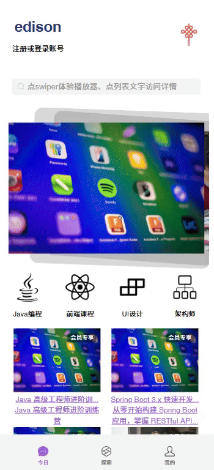

# 在线课程移动端（React + TypeScript）

一个基于 React 19、Vite、Ant Design Mobile 和 Zustand 的移动端课程应用示例，包含首页推荐、分类探索、课程详情、收藏体系、登录守卫和全局音频播放器。

## 项目预览



## 功能概览

- 今日页
	- 轮播 Banner（支持点击进入播放器）
	- 课程入口金刚区
	- 课程列表 + 无限滚动加载
- 探索页
	- 一级/二级分类联动筛选
	- 分类切换后自动刷新课程
- 课程详情页
	- 课程图文详情展示
	- 收藏/取消收藏
- 登录与权限
	- 登录后自动回跳目标页面（`target`）
	- `mine` 相关路由访问守卫
- 个人中心
	- 头像上传与持久化
	- 收藏入口
	- 账户退出
- 全局播放器
	- 全屏 Popup 播放器
	- 悬浮球控制播放/暂停

## 技术栈

- React 19
- TypeScript
- Vite 6
- React Router 7
- Zustand
- Ant Design Mobile
- Axios
- Sass
- Swiper

## 运行环境

- Node.js 18+（建议 20+）
- pnpm 8+

## 快速开始

```bash
git clone https://github.com/JP3000/online-course-mobile-react-ts.git
cd online-course-mobile-react-ts
pnpm install
pnpm dev
```

如你习惯 npm，也可使用：

```bash
npm install
npm run dev
```

## 可用脚本

```bash
pnpm dev      # 启动开发环境
pnpm build    # TypeScript 检查 + 生产构建
pnpm lint     # ESLint 检查
pnpm preview  # 本地预览构建产物
```

## 路由说明

| 路由 | 页面 | 说明 |
| --- | --- | --- |
| `/today` | 今日页 | 推荐内容聚合 |
| `/explore` | 探索页 | 分类筛选课程 |
| `/mine` | 个人中心 | 需要登录（通过 Main 内 guard） |
| `/detail/:id` | 课程详情 | 支持收藏/取消收藏 |
| `/mine/collect` | 我的收藏 | 受 `Guard` 组件保护 |
| `/login` | 登录页 | 支持 `target` 回跳 |
| `/zustand` | Zustand 示例页 | 状态管理演示页面 |

## 状态管理（Zustand）

- `src/store/user.ts`
	- 用户信息、登录加载态
	- 持久化键：`user-info-moblie`
	- 仅持久化 `userInfo`，不持久化瞬态 `isLoading`
- `src/store/player.ts`
	- 播放弹窗、播放状态、悬浮球状态
- `src/store/banner.ts`
	- Banner 拉取与本地追加（演示用途）
- `src/store/count.ts`
	- 计数器示例（演示用途）

## Mock 数据机制（默认开启）

当前项目默认可以在无后端环境下完整运行。

- 请求封装：`src/utils/request.ts`
- Mock 数据源：`src/utils/mock.ts`
- 已覆盖接口：
	- `POST /login`
	- `PUT /users/:id`
	- `GET /classes/ReactBanner`
	- `GET /classes/ReactCategory`
	- `GET /classes/ReactCourse`
	- `GET /classes/ReactCourse/:id`
	- `GET /classes/ReactCollect`
	- `POST /classes/ReactCollect`
	- `DELETE /classes/ReactCollect/:id`

说明：

- 虽然项目中保留了 LeanCloud 配置（`src/config/index.ts`），但上述接口会被拦截器优先走 Mock。
- 若需要切换真实后端，请调整 `request.ts` 中的 Mock 拦截逻辑。

## 测试账号

- 默认登录表单初始值：`admin / admin`
- 在当前 Mock 逻辑下，登录不会做严格账号密码校验。

## 目录结构

```text
.
├── public/images/                # Mock 课程图片、头像、Banner 图片
├── src
│   ├── api/                      # 接口层（home/course/user）
│   ├── components/               # 通用组件（播放器、课程卡片、导航等）
│   ├── config/                   # 基础配置（LeanCloud 参数）
│   ├── guard/                    # 路由守卫
│   ├── store/                    # Zustand 全局状态
│   ├── type/                     # 业务类型定义
│   ├── utils/                    # 请求封装、mock、rem 适配
│   └── views/                    # 页面模块
│       ├── today/
│       ├── explore/
│       ├── detail/
│       ├── login/
│       ├── mine/
│       ├── collect/
│       ├── main/
│       ├── zustand/              # 演示页
│       └── deepseek/             # 预留示例页
├── index.html
├── vite.config.ts
└── package.json
```

## 开发说明

- 移动端适配通过 `src/utils/rem.ts` 实现，设计稿基准宽度为 750。
- 根容器在 `src/App.css` 中限制为 `max-width: 750px`。
- 图标字体依赖 `index.html` 中的 Font Awesome CDN。

## 已知事项

- 个人中心中“历史记录”当前与“我的喜欢”共用收藏页跳转。
- “主题 / 设置”入口目前仅 Toast 提示，尚未接入实际功能。
- 存在示例/实验页面（如 `/zustand`、`deepseek`），业务接入前可按需精简。
- 构建时可能出现 chunk 体积告警（不影响产物生成）。

## 致谢

本项目用于前端学习与演示交流，感谢开源社区与相关课程内容支持。
